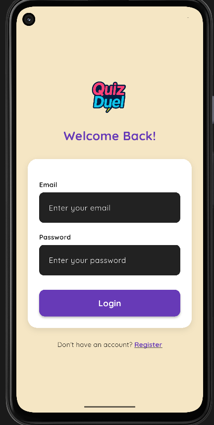
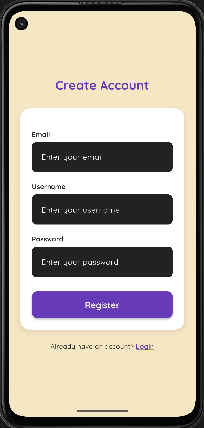
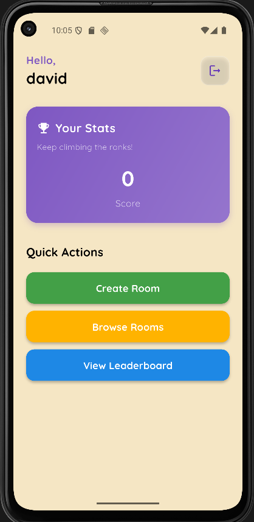
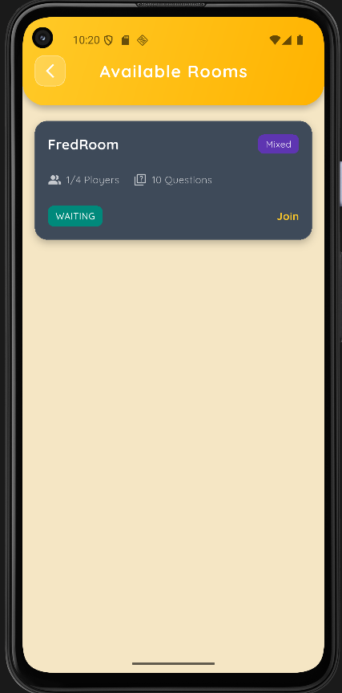
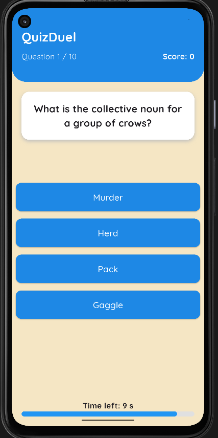
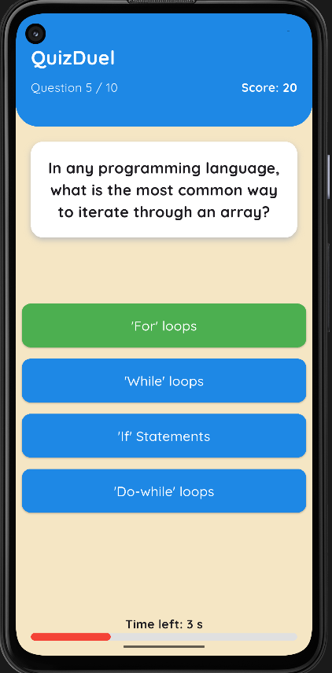
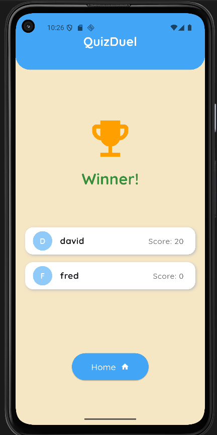
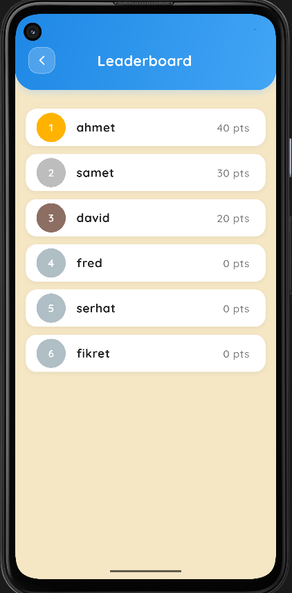

# 🧠 QuizDuel – Flutter Multiplayer Quiz App


---

## 📖 Introduction

**QuizDuel** est une application Flutter de **quiz multijoueur en ligne** avec gestion des *rooms*, synchronisation en temps réel et récupération dynamique de questions via l’**API Open Trivia DB**.  
Ce projet combine **Firebase Firestore**, **Realtime Database**, et **Retrofit/Dio** pour offrir une expérience de jeu fluide et connectée.

L’objectif : permettre à plusieurs joueurs de rejoindre une *room*, participer à un quiz en simultané et comparer leurs scores instantanément.

---

## 🌟 Fonctionnalités principales

- 🏠 **Création & jointure de rooms multijoueur**  
- 🔥 **Synchronisation temps réel** via **Firebase Realtime Database**  
- 🧩 **Questions dynamiques** depuis l’**API Open Trivia DB**  
- 🧠 **Gestion des joueurs et du host** (créateur de la room)  
- 🏆 **Affichage du classement final** après chaque partie  
- 💬 **Interface fluide et moderne** avec gestion d’état via **BLoC**  
- 🔊 **Effets sonores** pour bonnes et mauvaises réponses  

---

## 🖼️ Aperçu de l'application

<div align="center">

| | |
|:--:|:--:|
|  |  |
| *Écrans d'authentification* | *Création de compte* |
|  |  |
| *Accueil du joueur* | *Liste des rooms disponibles* |
|  |  |
| *Question du quiz* | *Réponse correcte affichée* |
|  |  |
| *Résultats finaux* | *Classement des joueurs* |

</div>

---

## 🛠️ Technologies utilisées

- **Framework** : Flutter `3.8.0+`  
- **Langage** : Dart  
- **Architecture** : Clean (Domain / Data / Presentation)  
- **State Management** : BLoC  
- **Backend** : Firebase (Firestore + Realtime Database)  
- **API externe** : [Open Trivia DB](https://opentdb.com/)  
- **HTTP Client** : Dio + Retrofit  
- **Testing** : bloc_test, mocktail, flutter_test  

---

## 📦 Packages principaux

| Package | Description |
|----------|-------------|
| `flutter_bloc` | Gestion d’état réactive avec BLoC |
| `firebase_core`, `cloud_firestore`, `firebase_database` | Backend et données en temps réel |
| `dio`, `retrofit`, `json_serializable` | Appels API Open Trivia et parsing JSON |
| `equatable` | Modèles immuables et égalité structurée |
| `audioplayers` | Effets sonores de feedback |
| `awesome_snackbar_content` | Messages visuels personnalisés |
| `mocktail`, `bloc_test` | Tests unitaires et de BLoC |

---

## ⚙️ Installation

### Prérequis
- Flutter SDK `3.8.0+`  
- Android Studio ou VS Code  
- Un émulateur ou appareil physique  
- Une configuration Firebase valide (`firebase_options.dart` déjà présent)  

### Étapes
```bash
# Cloner le projet
git clone https://github.com/Serhat6863/QuizDuel.git

# Aller dans le dossier
cd quizduel

# Installer les dépendances
flutter pub get

# Lancer l’application
flutter run
```

---

## 🏗️ Architecture du projet

```
QuizDuel/
├── lib/
│   ├── core/
│   │   ├── error/                     # Gestion des erreurs globales
│   │   └── utils/                     # Méthodes utilitaires et helpers (ex: logger)
│   │
│   ├── features/
│   │   ├── auth/                      # Authentification (inscription, login, etc.)
│   │   │   ├── data/                  # Couche data (API, Firebase, modèles)
│   │   │   │   ├── model/
│   │   │   │   ├── repository/
│   │   │   │   └── service/
│   │   │   ├── domain/                # Entités, usecases et contrats de repository
│   │   │   └── presentation/          # Interface utilisateur + logique de présentation
│   │   │       ├── bloc/              # AuthBloc, états et événements
│   │   │       ├── screen/            # Écrans Login / Register
│   │   │       └── widget/            # Widgets réutilisables d'authentification
│   │   │
│   │   ├── room/                      # Gestion des salons (rooms) de quiz
│   │   │   ├── data/                  
│   │   │   │   ├── model/
│   │   │   │   ├── repository/
│   │   │   │   └── service/
│   │   │   ├── domain/                
│   │   │   │   ├── entity/            # RoomEntity, UserEntity, etc.
│   │   │   │   ├── enums/             # États et types des rooms
│   │   │   │   └── repository/        # Interfaces des repositories
│   │   │   └── presentation/          
│   │   │       ├── bloc/              # RoomBloc : création, jointure, suppression
│   │   │       ├── screen/            # RoomHomeScreen, RoomListScreen, etc.
│   │   │       └── widget/            # Composants UI (cards, listes, etc.)
│   │   │
│   │   └── game/                      # Logique du quiz multijoueur
│   │       ├── data/
│   │       ├── domain/
│   │       └── presentation/
│   │           ├── bloc/              # GameBloc : gestion du quiz, score, timer
│   │           ├── screen/            # GameScreen, WinnerScreen
│   │           └── widget/            # Widgets du quiz (options, timer, etc.)
│   │
│   ├── firebase_options.dart          # Configuration Firebase (auto-généré)
│   └── main.dart                      # Point d’entrée principal de l’app Flutter
│
├── screenshots/                       # Captures d’écran du projet
│   ├── login_screen.png
│   ├── register_screen.png
│   ├── home_screen.png
│   ├── available_room_screen.png
│   ├── question_screen.png
│   ├── correct_answer_screen.png
│   ├── leaderboard_screen.png
│   ├── winner_screen.png
│   └── ...
│
├── assets/
│   ├── images/                        # Ressources visuelles (logos, backgrounds)
│   └── sound/                         # Effets sonores (bonne/mauvaise réponse)
│
└── pubspec.yaml                       # Dépendances, assets et configuration globale

```

---

## 📅 Statut du projet

✅ **Projet terminé** – dernière version stable disponible sur GitHub.

L’application **QuizDuel** est finalisée et fonctionnelle.  
Toutes les fonctionnalités principales sont implémentées, testées et intégrées à l’architecture Clean (Data / Domain / Presentation).

| 🧩 Fonctionnalité | 📌 Statut | 📝 Détails |
|------------------|-----------|------------|
| **Authentification utilisateur** | ✅ Terminée | Connexion, inscription et gestion des utilisateurs via Firebase Auth |
| **Création / jointure de room** | ✅ Terminée | Les joueurs peuvent créer ou rejoindre une partie en temps réel |
| **Suppression automatique d’une room** | ✅ Terminée | Suppression automatique lorsqu’un host quitte la partie |
| **Intégration API Open Trivia** | ✅ Terminée | Récupération dynamique des questions via Retrofit & Dio |
| **Système de quiz multijoueur** | ✅ Terminé | Synchronisation temps réel des questions et scores |
| **Classement final & interface UI** | ✅ Terminée | Affichage des résultats finaux et WinnerScreen |
| **Refactorisation architecture** | ✅ Finalisée | Architecture Clean stable et testée |
| **Tests unitaires & BLoC** | ✅ Terminés | Utilisation de `bloc_test` et `mocktail` |
| **Effets sonores et feedback visuel** | ✅ Terminés | Gestion audio avec `audioplayers` |

---

## Contact  

Si vous souhaitez en savoir plus sur ce projet ou discuter de développement Flutter, n’hésitez pas à me contacter :  

**kurkluserhat@gmail.com**   
[GitHub – Serhat6863](https://github.com/Serhat6863)  

---

✨ Développé avec **Flutter**  
© 2025 – Serhat KÜRKLÜ

